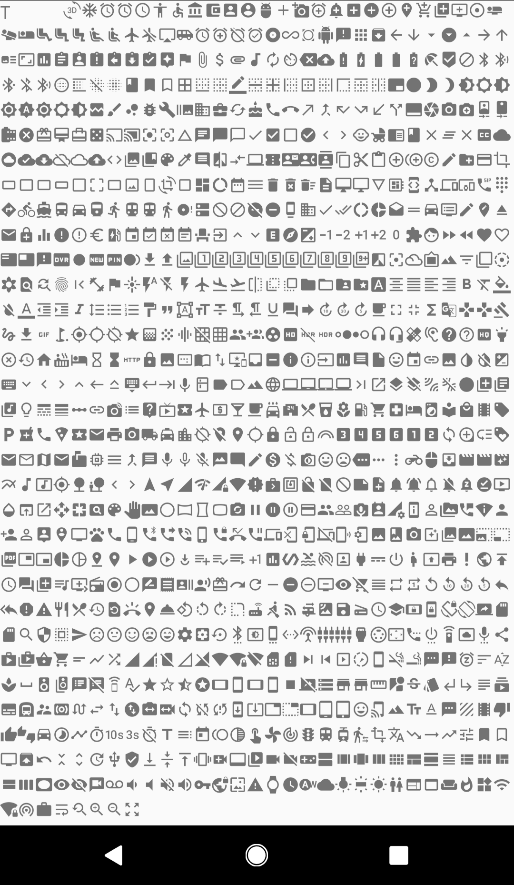

# google-material-font

[](https://jitpack.io/#yongjhih/google-material-font)
[](https://travis-ci.org/yongjhih/google-material-font)


You can easily to add an icon by TextView with google material icons:

```xml
<TextView
  ...
  android:text="@string/gmd_help_outline"
  app:fontFamily="@font/google_material"
/>
```

That's it.

It's quiet lightweight and better performance without JVM reflection.

If you want to do inline text, you can use [`Resources.getString()`](https://developer.android.com/guide/topics/resources/string-resource#FormattingAndStyling) or just using 3rd string template engine such as [`square/phrase`](https://github.com/square/phrase)

ref. https://medium.com/square-corner-blog/android-string-formatting-with-phrase-33b7c8707e18



## Installation

```gradle
repositories {
    maven { url "https://jitpack.io" }
}

dependencies {
    compile 'com.github.yongjhih:google-material-font:-SNAPSHOT'
}
```

## Credit & References

* https://github.com/google/material-design-icons/
* https://design.google.com/icons/

## LICENCE

apache-2.0
