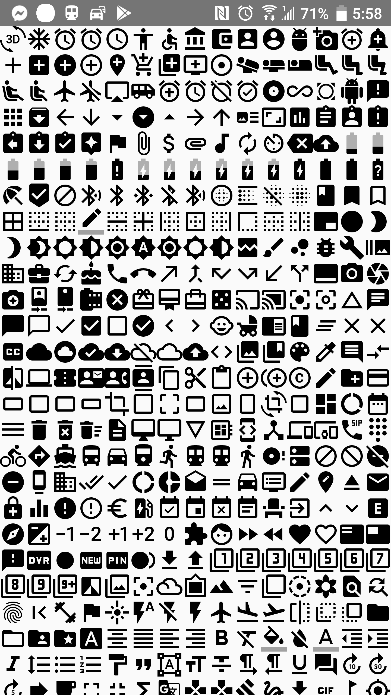

# google-material-font

[](https://jitpack.io/#yongjhih/google-material-font)
[](https://travis-ci.org/yongjhih/google-material-font)

```xml
android:text="@string/gmd_help_outline"
```

```xml
app:fontFamily="@font/google_material"
```



## Installation

```gradle
repositories {
    maven { url "https://jitpack.io" }
}

dependencies {
    compile 'com.github.yongjhih:google-material-font:-SNAPSHOT'
}
```

## Credit & References

* https://github.com/google/material-design-icons/
* https://design.google.com/icons/

## LICENCE

apache-2.0
